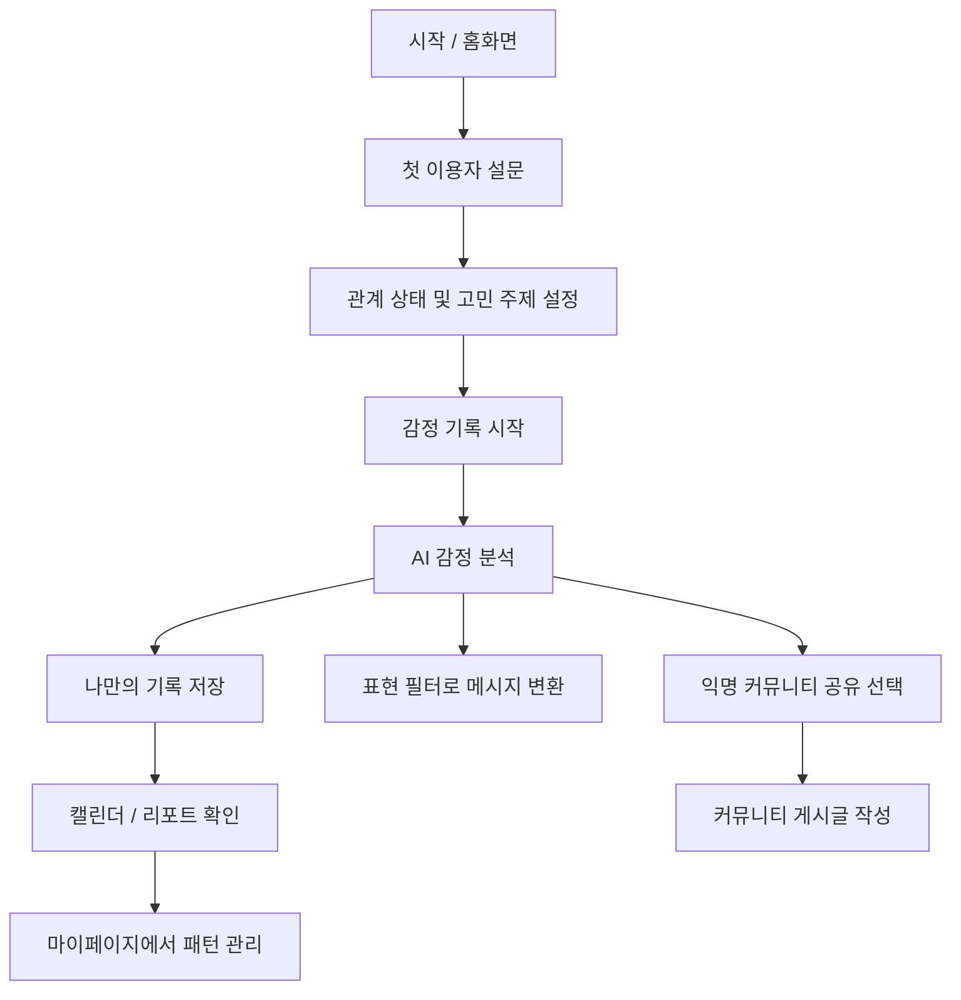

# 쀼라인드 전체 기능 관리 문서

---

## 0. 서비스 개요

### 서비스명
**쀼라인드**

### 서비스 한 줄 설명
연인·부부가 말하지 못한 속마음과 반복되는 갈등 패턴을 기록하고, AI가 감정 분석·표현 변환·관계 회복 액션을 도와주는 관계 케어 웹앱

### 주요 사용자
- 연애 중인 커플
- 신혼부부
- 기혼부부
- 자녀가 있는 부부
- 관계 갈등을 기록하고 정리하고 싶은 사용자

### 핵심 가치
- 내 감정을 안전하게 기록한다.
- 반복되는 갈등 패턴을 발견한다.
- 상대에게 상처 덜 주는 표현으로 바꾼다.
- 비슷한 고민을 가진 사람들의 사례를 참고한다.
- 관계 회복에 도움이 되는 행동, 데이트, 선물, 대화를 추천받는다.

---

# 1. ChatGPT가 아닌 쀼라인드를 이용해야 하는 이유

## 1.1 핵심 차별화 포인트

쀼라인드는 단순히 AI에게 고민을 묻는 서비스가 아니라, 사용자의 관계 맥락과 감정 기록이 계속 쌓이는 **관계 전용 맞춤형 케어 서비스**이다.

일반 ChatGPT는 사용자가 매번 상황을 설명하고 원하는 답변 형식을 직접 프롬프트로 요청해야 하지만, 쀼라인드는 텍스트·음성·카톡 캡처 등 사용자가 편한 방식으로 입력하면 서비스가 자동으로 감정 분석, 갈등 원인 분석, 표현 변환, 기록 저장, 커뮤니티 공유까지 이어준다.

---

## 1.2 ChatGPT와 쀼라인드 비교

| 구분 | ChatGPT | 쀼라인드 |
|---|---|---|
| 입력 방식 | 매번 상황과 배경을 직접 설명해야 함 | 텍스트, 음성, 카톡 캡처를 그대로 넣으면 자동 분석 |
| 프롬프트 부담 | 사용자가 원하는 답변을 얻기 위해 프롬프트를 직접 작성해야 함 | 버튼과 기능 흐름에 따라 프롬프트 없이 사용 가능 |
| 기억 / 연속성 | 대화가 1회성으로 끝나기 쉬움 | 감정 기록, 역린, 치트키, 서운함 포인트가 누적됨 |
| 개인 맞춤화 | 사용자가 매번 관계 상태와 맥락을 설명해야 함 | 관계 상태, 결혼 연차, 자녀 나이, 고민 주제 기반 맞춤 분석 |
| 분석 결과 | 답변 중심 | 감정, 갈등 원인, 숨은 욕구, 반복 패턴 등 구조화된 분석 제공 |
| 기록 관리 | 사용자가 별도로 정리해야 함 | 날짜별 기록, 비밀 도감, 리포트로 자동 관리 |
| 행동 연결 | 조언을 듣고 사용자가 직접 행동해야 함 | 변환된 문장을 바로 카톡 전송하거나 기념일·데이트·선물 추천으로 연결 |
| 자기 검사 추적 | 지속적인 변화 추적이 어려움 | 주간/월간 리포트로 감정 변화와 갈등 패턴 추적 |
| 위기 대응 | 일반적인 답변에 머물 수 있음 | 상담기관, 쉼터, 경찰 등 외부 도움 연계 가능 |
| 커뮤니티 | 다른 사람의 유사 사례를 보기 어려움 | 비슷한 상황의 익명 고민과 공감 기반 커뮤니티 제공 |

---

## 1.3 사용자 관점에서의 사용 이유

### 1. 매번 설명하지 않아도 된다

ChatGPT를 사용할 때는 사용자가 직접 이런 내용을 매번 설명해야 한다.

- 우리는 연애 중인지, 신혼인지, 기혼인지
- 결혼한 지 얼마나 되었는지
- 자녀가 있는지
- 어떤 갈등이 반복되는지
- 상대가 싫어하는 말투가 무엇인지
- 내가 자주 서운해하는 포인트가 무엇인지
- 원하는 답변 톤이 무엇인지

쀼라인드는 초기 설문과 누적 기록을 바탕으로 사용자의 관계 맥락을 저장하기 때문에, 매번 긴 설명 없이도 더 빠르게 맞춤형 분석을 받을 수 있다.

---

### 2. 내 기록이 쌓이면서 더 개인화된다

쀼라인드는 단순한 상담 챗봇이 아니라, 사용자의 감정과 관계 패턴이 쌓이는 **우리 관계 전용 DB** 역할을 한다.

누적되는 데이터 예시는 다음과 같다.

- 내가 자주 서운해하는 포인트
- 배우자 / 연인이 건드리면 안 되는 역린
- 기분이 풀리는 치트키 음식 / 행동
- 흘려 말했던 위시리스트
- 반복되는 갈등 주제
- 자주 등장하는 감정 패턴
- 대화가 잘 풀렸던 방식
- 상대에게 전달하면 효과적이었던 표현

이 데이터가 쌓일수록 AI는 단순한 일반 조언이 아니라, 사용자에게 더 맞는 분석과 솔루션을 제공할 수 있다.

---

### 3. 분석 결과가 구조화되어 제공된다

ChatGPT는 대화형 답변을 제공하는 데 강점이 있지만, 사용자가 자신의 감정을 장기적으로 관리하려면 답변을 다시 정리해야 한다.

쀼라인드는 분석 결과를 다음과 같이 구조화해서 제공한다.

- 현재 감정
- 감정 강도
- 갈등 원인
- 숨은 욕구
- 반복되는 패턴
- 상대에게 전달하기 좋은 문장
- 오늘 새롭게 알게 된 나의 모습
- 비밀 도감에 저장할 만한 항목
- 주간/월간 감정 리포트

이를 통해 사용자는 자신의 감정과 관계 변화를 더 쉽게 추적할 수 있다.

---

### 4. 답변에서 끝나지 않고 행동으로 이어진다

ChatGPT는 주로 조언과 답변을 제공하지만, 쀼라인드는 사용자가 실제 행동으로 옮길 수 있는 기능까지 연결한다.

예시는 다음과 같다.

- 비난형 문장을 요청형 문장으로 변환
- 카톡으로 바로 보낼 수 있는 짧은 문장 생성
- 사과하기 / 대화 시작하기 / 화해 요청하기 메시지 추천
- 기념일 알림
- 데이트 코스 추천
- 선물 추천
- 관계 회복을 위한 여행 추천
- 커뮤니티 공유용 익명 글 초안 생성

즉, 쀼라인드는 “무슨 말을 해야 할지”에서 끝나는 것이 아니라 “어떻게 보내고, 어떤 행동을 하면 좋을지”까지 이어준다.

---

### 5. 혼자 고민하지 않게 해준다

관계 고민은 주변 사람에게 말하기 어렵고, 검색으로 해결하기도 어렵다. 쀼라인드는 익명 커뮤니티를 통해 비슷한 상황의 사람들 고민을 볼 수 있게 한다.

커뮤니티 기능을 통해 사용자는 다음을 얻을 수 있다.

- 비슷한 결혼 연차 / 자녀 나이의 고민 확인
- 나와 유사한 갈등 사례 추천
- 공감 기반 인기 고민글 확인
- 관계 회복 후기 참고
- 내 기록을 개인정보 제거 후 익명 게시글로 공유
- AI 요약과 태그를 통해 고민을 쉽게 정리

이 기능은 ChatGPT 단독 사용과 다른 중요한 차별점이다.

---

### 6. 위험 상황에서는 외부 도움으로 연결할 수 있다

쀼라인드는 단순한 관계 조언을 넘어, 위험 상황이 감지될 경우 외부 도움으로 연결되는 구조를 가질 수 있다.

연계 가능한 예시는 다음과 같다.

- 상담기관
- 부부 상담 센터
- 정신건강복지센터
- 여성긴급전화
- 쉼터
- 경찰
- 긴급 신고 안내

특히 가정폭력, 협박, 스토킹, 자해 암시, 강압적 관계 등은 일반적인 관계 회복 조언보다 안전 확보가 우선되어야 한다.

---

## 1.4 한 문장 차별화 정의

**ChatGPT가 관계 고민에 대한 답변을 주는 도구라면, 쀼라인드는 사용자의 관계 맥락과 감정 기록을 쌓아 분석하고, 표현 변환·행동 추천·커뮤니티·외부 도움 연계까지 제공하는 관계 전용 케어 플랫폼이다.**

---

## 1.5 핵심 메시지

| 키워드 | 설명 |
|---|---|
| 개인 맞춤화 | 관계 상태, 고민 주제, 감정 기록 기반 맞춤 분석 |
| 연속성 | 기록이 쌓일수록 더 정확한 관계 패턴 파악 |
| 자동화 | 프롬프트 없이 텍스트/음성/카톡 캡처 기반 자동 분석 |
| 구조화 | 감정, 원인, 욕구, 패턴, 리포트로 결과 제공 |
| 행동 연결 | 문장 변환, 카톡 전송, 기념일 알림, 데이트/선물 추천 |
| 커뮤니티 | 비슷한 고민을 가진 사람들과 익명으로 연결 |
| 안전망 | 위험 상황에서 상담기관, 쉼터, 경찰 등으로 연계 가능 |


---

## 2. 전체 사용자 흐름



---

## 3. 화면 구조

| 번호 | 화면 | 핵심 목적 |
|---|---|---|
| 1 | 시작 / 홈화면 | 서비스 소개, 첫 설문, 감정 기록 진입 |
| 2 | 기록 | 속마음 기록, 음성 기록, 채팅 분석, AI 인사이트 저장 |
| 3 | 필터 | 감정 표현을 상대에게 전달하기 좋은 문장으로 변환 |
| 4 | 캘린더 | 날짜별 감정 흐름, 기념일, 데이트/선물 추천 관리 |
| 5 | 커뮤니티 | 익명 고민 공유, 유사 고민 추천, 공감 기반 게시판 |
| 6 | 마이페이지 | 프로필, 관계 설정, 리포트, 비밀 도감 관리 |

---

# 4. 화면별 기능 상세

---

## 3.1 시작 / 홈화면

### 화면 목적
첫 이용자가 서비스의 목적을 이해하고, 자신의 관계 상태와 고민 주제를 설정한 뒤 감정 기록을 시작하도록 유도한다.

### 주요 기능

| 기능 | 설명 | 우선순위 |
|---|---|---|
| 서비스 안내 화면 | 쀼라인드가 어떤 서비스인지 소개 | MVP |
| 첫 이용자 맞춤 질문 / 설문 | 사용자의 관계 상태와 고민 주제 파악 | MVP |
| 설문 중복 선택 기능 | 고민 주제, 원하는 도움 유형 등을 복수 선택 | MVP |
| 관계 상태 설정 | 연애, 신혼, 기혼, 자녀 있음 등 선택 | MVP |
| 결혼 연차 입력 | 기혼/신혼 사용자의 관계 기간 입력 | 1차 |
| 자녀 나이 입력 | 자녀가 있는 사용자의 상황 파악 | 1차 |
| 주요 고민 주제 입력 | 대화, 육아, 돈, 성격, 스킨십, 시댁/처가 등 | MVP |
| AI 응답 톤 설정 | 다정한 톤, 현실적인 톤, 차분한 톤 등 | MVP |
| 감정 기록 시작하기 | 기록 화면으로 이동 | MVP |
| 정밀 심층 설문 보기 | 관계 패턴을 더 깊게 파악하는 설문 | 2차 |

### 입력 데이터
- 관계 상태
- 연애/결혼 기간
- 자녀 여부
- 자녀 나이
- 주요 고민 주제
- AI 응답 톤
- 원하는 도움 유형

### 다음 화면
- 기록 화면
- 정밀 심층 설문 화면
- 마이페이지 설정 화면

---

## 3.2 기록

### 화면 목적
사용자가 말하기 어려운 속마음을 텍스트, 음성, 채팅 캡처 등으로 기록하고 AI 분석을 받을 수 있게 한다.

### 주요 기능

| 기능 | 설명 | 우선순위 |
|---|---|---|
| 텍스트로 속마음 기록 | 사용자가 직접 감정과 상황을 작성 | MVP |
| 음성으로 감정 기록 | 음성을 텍스트로 변환하여 감정 기록 | 1차 |
| 채팅 캡처 / 대화 내용 기반 감정 분석 | 카톡 캡처 또는 대화 텍스트 분석 | 1차 |
| AI 감정 분석 | 감정, 갈등 원인, 숨은 욕구 분석 | MVP |
| 오늘 나에 대해 새롭게 알게 된 사실 | AI 분석 후 자기 이해 문장 제공 | MVP |
| 나만 볼 수 있는 비밀 카테고리 기록 | 민감한 개인 기록을 별도 저장 | MVP |
| 기록 후 익명 커뮤니티 공유 여부 선택 | 기록 내용을 커뮤니티에 공유할지 선택 | 1차 |
| AI 개인정보 제거 | 이름, 장소, 연락처 등 제거 | 1차 |
| 익명 게시글 초안 생성 | 커뮤니티 공유용 글 자동 생성 | 1차 |

### 비밀 카테고리 예시
- 배우자가 건드리면 안 되는 역린
- 기분이 풀리는 치트키 음식 / 행동
- 흘려 말했던 위시리스트
- 자주 서운해하는 포인트
- AI 상담 / 카톡 분석에서 나온 핵심 인사이트

### AI 분석 항목
- 현재 감정
- 감정 강도
- 갈등 원인
- 숨은 욕구
- 반복 패턴 여부
- 상대에게 전달하면 좋은 핵심 문장
- 오늘 새롭게 알게 된 나의 모습
- 저장할 만한 비밀 도감 항목

### 입력 데이터
- 기록 타입: 텍스트 / 음성 / 채팅 캡처 / 대화 텍스트
- 원문 기록
- 감정 태그
- 공개 여부
- 커뮤니티 공유 여부

### 출력 데이터
- 감정 분석 결과
- 갈등 원인 분석
- 숨은 욕구 분석
- 자기 이해 문장
- 비밀 도감 저장 후보
- 익명 게시글 초안

---

## 3.3 필터

### 화면 목적
사용자의 감정 표현을 상대방에게 더 안전하고 효과적으로 전달할 수 있는 문장으로 바꿔준다.

### 주요 기능

| 기능 | 설명 | 우선순위 |
|---|---|---|
| 감정 표현 톤 변환 | 사용자의 원문을 다른 톤으로 변환 | MVP |
| 부드러운 말투로 바꾸기 | 공격성을 낮추고 다정하게 변환 | MVP |
| 솔직한 말투로 바꾸기 | 감정을 숨기지 않되 비난은 줄임 | MVP |
| 카톡용 짧은 문장 생성 | 바로 보낼 수 있는 짧은 메시지 생성 | MVP |
| 상대에게 전달하기 좋은 표현 추천 | 상황에 맞는 대화 문장 제안 | MVP |
| 비난형 표현 → 요청형 표현 변환 | “왜 맨날 그래?”를 “나는 이런 점이 힘들어”로 변환 | MVP |
| 상황별 메시지 추천 | 사과, 대화 시작, 서운함 전달, 화해 요청 등 | MVP |

### 상황별 메시지 카테고리
- 사과하기
- 대화 시작하기
- 서운함 전달하기
- 화해 요청하기
- 감정 정리 후 말 꺼내기
- 상대를 비난하지 않고 요청하기
- 기념일 / 특별한 날 메시지 작성

### 입력 데이터
- 사용자가 쓴 원문
- 원하는 톤
- 메시지 목적
- 상대와의 관계 상태
- 보내는 채널: 카톡 / 문자 / 직접 말하기

### 출력 데이터
- 변환된 문장
- 짧은 버전
- 긴 버전
- 부드러운 버전
- 솔직한 버전
- 카톡용 버전
- 말로 전달하는 버전

---

## 3.4 캘린더

### 화면 목적
날짜별 감정 기록과 관계 이벤트를 한눈에 확인하고, 기념일·데이트·선물 추천으로 관계 회복 액션을 도와준다.

### 주요 기능

| 기능 | 설명 | 우선순위 |
|---|---|---|
| 날짜별 감정 기록 확인 | 특정 날짜의 감정 기록 확인 | MVP |
| 감정 변화 흐름 확인 | 주간/월간 감정 흐름 시각화 | MVP |
| 기념일 기록 | 결혼기념일, 만난 날 등 저장 | 1차 |
| 다툰 날 기록 | 갈등이 있었던 날짜 표시 | MVP |
| 대화한 날 기록 | 관계 회복 대화가 있었던 날 표시 | 1차 |
| 결혼기념일 알림 | 기념일 전 알림 제공 | 2차 |
| 추천 데이트 기능 | 상황과 위치 기반 데이트 추천 | 2차 |
| 추천 선물 기능 | 기념일/감정 상태 기반 선물 추천 | 2차 |
| 위치 기반 데이트 코스 추천 | 현재 위치 또는 선택 지역 기반 추천 | 2차 |
| 국내여행 / 패키지 여행 추천 | 관계 회복 목적의 여행 추천 | 3차 |
| AI 추천 문구 / 코스 제공 | 기념일 메시지, 데이트 코스 자동 추천 | 2차 |
| 광고·제휴 확장 | 호텔, 선물, 여행, 마켓컬리 등 | 3차 |

### 캘린더 이벤트 타입
- 감정 기록
- 다툰 날
- 대화한 날
- 화해한 날
- 기념일
- 데이트한 날
- 선물한 날
- 여행한 날

### 입력 데이터
- 날짜
- 감정 기록 ID
- 이벤트 타입
- 메모
- 기념일 정보
- 위치 정보
- 추천 받고 싶은 항목

### 출력 데이터
- 날짜별 기록 목록
- 감정 흐름 요약
- 반복 갈등 주기
- 추천 데이트 코스
- 추천 선물
- 기념일 메시지

---

## 3.5 커뮤니티

### 화면 목적
사용자가 비슷한 상황의 사람들의 고민을 보고, 자신의 고민도 익명으로 공유하며 공감과 위로를 받을 수 있게 한다.

### 주요 기능

| 기능 | 설명 | 우선순위 |
|---|---|---|
| 비슷한 상황의 사람들 고민 보기 | 유사한 관계 상태의 고민 노출 | MVP |
| 부부/연인 익명 고민 공유 | 익명 게시글 작성 | MVP |
| 부부 블라인드 커뮤니티 | 관계 고민 중심 익명 게시판 | MVP |
| 관계 회복 게시판 | 화해, 대화, 회복 사례 공유 | 1차 |
| 데이트 코스 공유 게시판 | 사용자 추천 데이트 장소 공유 | 2차 |
| 기록/상담/채팅 분석 결과 불러오기 | 내 기록 기반 글 작성 | 1차 |
| 상담 내용 익명 공유 여부 확인 | 민감 정보 공유 전 확인 | MVP |
| AI 개인정보 제거 | 실명, 장소, 연락처 등 제거 | 1차 |
| 익명 게시글 초안 생성 | AI가 공유용 게시글 작성 | 1차 |
| 유사 고민 말풍선 | 결혼 연차, 자녀 나이 기반 고민 추천 | 2차 |
| 벡터 매칭 기반 유사 고민 추천 | 실제 고민 텍스트 기반 유사 사례 추천 | 2차 |
| 공감 / 비공감 기능 | 게시글 반응 기능 | MVP |
| 최근 한 달 베스트 공감 게시물 | 인기 고민글 노출 | 1차 |
| AI 고민글 요약 및 태그 추천 | 글의 핵심 요약과 태그 자동 생성 | 1차 |

### 게시판 카테고리
- 연애 고민
- 신혼 고민
- 기혼 고민
- 자녀 있음
- 대화 문제
- 돈 문제
- 집안일 문제
- 육아 문제
- 스킨십 / 친밀감
- 시댁 / 처가
- 화해 후기
- 데이트 코스 추천

### 입력 데이터
- 게시글 제목
- 게시글 본문
- 익명 닉네임
- 관계 상태
- 결혼/연애 기간
- 자녀 여부
- 태그
- 감정 기록 불러오기 여부

### 출력 데이터
- 익명 게시글
- AI 요약
- 추천 태그
- 유사 고민글 목록
- 공감 수
- 비공감 수
- 베스트 게시글 목록

---

## 3.6 마이페이지

### 화면 목적
사용자의 프로필, 관계 정보, 기록, 커뮤니티 활동, 리포트, 비밀 도감을 관리한다.

### 주요 기능

| 기능 | 설명 | 우선순위 |
|---|---|---|
| 내 프로필 설정 | 닉네임, 기본 정보 관리 | MVP |
| 관계 상태 설정 | 연애, 신혼, 기혼, 자녀 있음 등 | MVP |
| 배우자 / 연인 정보 설정 | 상대방 관련 기본 정보 저장 | 1차 |
| AI 응답 톤 설정 | 원하는 AI 말투 설정 | MVP |
| 내가 쓴 기록 관리 | 감정 기록 목록 확인/삭제 | MVP |
| 커뮤니티 글 관리 | 내가 쓴 글, 댓글 관리 | MVP |
| 주간 리포트 확인 | 한 주간 감정과 갈등 요약 | 1차 |
| 월간 리포트 확인 | 한 달간 감정 흐름과 패턴 요약 | 1차 |
| 이번 달 새롭게 알게 된 나의 모습 | 자기 이해 요약 | 1차 |
| 반복되는 갈등 패턴 확인 | 자주 반복되는 갈등 원인 분석 | 1차 |
| 나만의 비밀 도감 관리 | 민감한 개인 인사이트 관리 | MVP |
| 배우자 이해 노트 관리 | 상대방 관련 기억과 주의점 관리 | 1차 |

### 배우자 이해 노트 예시
- 서운함 포인트
- 기분 풀리는 행동
- 위시리스트
- 대화 금지 주제
- 좋아하는 표현
- 싫어하는 표현
- 자주 반복되는 갈등 상황

### 입력 데이터
- 프로필 정보
- 관계 상태
- 상대방 정보
- AI 응답 톤
- 알림 설정
- 리포트 확인 기간

### 출력 데이터
- 내 기록 목록
- 커뮤니티 활동 내역
- 주간 리포트
- 월간 리포트
- 비밀 도감
- 배우자 이해 노트

---

# 5. AI 기능 정리

## 4.1 AI 분석 기능

| AI 기능 | 사용 화면 | 설명 | 우선순위 |
|---|---|---|---|
| 감정 분석 | 기록 | 사용자의 감정 상태 분석 | MVP |
| 갈등 원인 분석 | 기록 | 갈등의 핵심 원인 추정 | MVP |
| 숨은 욕구 분석 | 기록 | 사용자가 진짜 원하는 것 분석 | MVP |
| 자기 이해 문장 생성 | 기록 / 마이페이지 | 오늘 새롭게 알게 된 나의 모습 정리 | MVP |
| 표현 톤 변환 | 필터 | 말투를 부드럽게/솔직하게 변환 | MVP |
| 요청형 표현 변환 | 필터 | 비난형 문장을 요청형으로 변환 | MVP |
| 카톡 문장 생성 | 필터 | 바로 보낼 수 있는 짧은 문장 생성 | MVP |
| 개인정보 제거 | 기록 / 커뮤니티 | 익명 공유 전 민감정보 제거 | 1차 |
| 익명 게시글 초안 생성 | 기록 / 커뮤니티 | 커뮤니티 공유용 글 생성 | 1차 |
| 고민글 요약 | 커뮤니티 | 게시글 핵심 요약 | 1차 |
| 태그 추천 | 커뮤니티 | 게시글에 맞는 태그 추천 | 1차 |
| 유사 고민 추천 | 커뮤니티 | 벡터 매칭 기반 유사 글 추천 | 2차 |
| 주간/월간 리포트 생성 | 마이페이지 | 감정 흐름과 갈등 패턴 요약 | 1차 |
| 데이트/선물 추천 | 캘린더 | 상황 기반 관계 회복 액션 추천 | 2차 |

---

# 6. 데이터 구조 초안

## 5.1 User

| 필드 | 설명 |
|---|---|
| userId | 사용자 고유 ID |
| nickname | 닉네임 |
| relationshipStatus | 관계 상태 |
| relationshipDuration | 연애/결혼 기간 |
| hasChildren | 자녀 여부 |
| childrenAge | 자녀 나이 |
| mainConcernTopics | 주요 고민 주제 |
| aiTone | AI 응답 톤 |
| createdAt | 가입일 |
| updatedAt | 수정일 |

---

## 5.2 EmotionRecord

| 필드 | 설명 |
|---|---|
| recordId | 기록 ID |
| userId | 작성자 ID |
| inputType | text / voice / chat_capture / chat_text |
| originalText | 원문 기록 |
| emotionTags | 감정 태그 |
| emotionScore | 감정 강도 |
| conflictCause | 갈등 원인 |
| hiddenNeeds | 숨은 욕구 |
| selfInsight | 오늘 새롭게 알게 된 나의 모습 |
| privateCategoryCandidates | 비밀 도감 저장 후보 |
| isSharedToCommunity | 커뮤니티 공유 여부 |
| createdAt | 작성일 |

---

## 5.3 PrivateArchive

| 필드 | 설명 |
|---|---|
| archiveId | 비밀 도감 ID |
| userId | 사용자 ID |
| category | 역린 / 치트키 / 위시리스트 / 서운함 포인트 / 금지 주제 |
| content | 저장 내용 |
| sourceRecordId | 출처 기록 ID |
| createdAt | 생성일 |
| updatedAt | 수정일 |

---

## 5.4 CommunityPost

| 필드 | 설명 |
|---|---|
| postId | 게시글 ID |
| userId | 작성자 ID |
| anonymousName | 익명 닉네임 |
| title | 제목 |
| content | 본문 |
| aiSummary | AI 요약 |
| tags | 태그 |
| relationshipStatus | 관계 상태 |
| relationshipDuration | 연애/결혼 기간 |
| hasChildren | 자녀 여부 |
| likeCount | 공감 수 |
| dislikeCount | 비공감 수 |
| sourceRecordId | 불러온 감정 기록 ID |
| createdAt | 작성일 |
| updatedAt | 수정일 |

---

## 5.5 CalendarEvent

| 필드 | 설명 |
|---|---|
| eventId | 이벤트 ID |
| userId | 사용자 ID |
| eventDate | 날짜 |
| eventType | 감정 기록 / 다툰 날 / 대화한 날 / 기념일 / 데이트 / 여행 |
| title | 이벤트 제목 |
| memo | 메모 |
| relatedRecordId | 연결된 감정 기록 ID |
| createdAt | 생성일 |
| updatedAt | 수정일 |

---

## 5.6 Report

| 필드 | 설명 |
|---|---|
| reportId | 리포트 ID |
| userId | 사용자 ID |
| reportType | weekly / monthly |
| periodStart | 시작일 |
| periodEnd | 종료일 |
| emotionSummary | 감정 요약 |
| conflictPatterns | 반복 갈등 패턴 |
| selfInsightSummary | 새롭게 알게 된 나의 모습 |
| recommendedActions | 추천 행동 |
| createdAt | 생성일 |

---

# 7. 개발 우선순위

## 6.1 MVP

### 목표
기록 → AI 분석 → 표현 변환 → 저장 → 커뮤니티 공유까지 핵심 흐름을 구현한다.

### MVP 포함 기능
- 시작 / 홈화면
- 첫 이용자 설문
- 관계 상태 설정
- AI 응답 톤 설정
- 텍스트 감정 기록
- AI 감정 분석
- 갈등 원인 분석
- 숨은 욕구 분석
- 자기 이해 문장 생성
- 비밀 도감 저장
- 필터 문장 변환
- 카톡용 짧은 문장 생성
- 커뮤니티 익명 게시글 작성
- 공감 / 비공감
- 마이페이지 기본 설정
- 내가 쓴 기록 관리

---

## 6.2 1차 고도화

### 목표
사용자 기록과 커뮤니티 연결성을 강화하고, 리포트 기능을 추가한다.

### 포함 기능
- 음성 감정 기록
- 채팅 캡처 / 대화 텍스트 분석
- 개인정보 제거
- 익명 게시글 초안 생성
- 관계 회복 게시판
- 최근 한 달 베스트 공감 게시물
- AI 고민글 요약
- AI 태그 추천
- 주간 리포트
- 월간 리포트
- 배우자 / 연인 정보 설정
- 배우자 이해 노트

---

## 6.3 2차 고도화

### 목표
추천 기능과 유사 고민 매칭을 강화한다.

### 포함 기능
- 정밀 심층 설문
- 유사 고민 말풍선
- 벡터 매칭 기반 유사 고민 추천
- 데이트 코스 공유 게시판
- 기념일 알림
- 추천 데이트 기능
- 추천 선물 기능
- 위치 기반 데이트 코스 추천
- 기념일 AI 추천 문구

---

## 6.4 3차 확장

### 목표
광고·제휴·수익화 기능을 연결한다.

### 포함 기능
- 국내여행 추천
- 패키지 여행 추천
- 호텔 숙박권 제휴
- 선물 추천 제휴
- 여행 상품 제휴
- 마켓컬리 등 커머스 제휴
- 위치 기반 광고
- 기념일 기반 광고

---

# 8. 정책 및 주의사항

## 7.1 민감 정보 처리

쀼라인드는 관계 고민과 개인 감정을 다루기 때문에 다음 정보는 특히 주의해서 처리해야 한다.

- 실명
- 전화번호
- 주소
- 직장명
- 학교명
- 자녀 실명
- 배우자 / 연인 실명
- 카카오톡 대화 원문
- 성적 친밀감 관련 민감 내용
- 정신건강 또는 자해 관련 내용

## 7.2 커뮤니티 공유 전 필수 확인

커뮤니티 공유 전 사용자가 반드시 확인해야 하는 항목

- 익명 공유에 동의하는가?
- 원문 기록이 그대로 공유되지 않는가?
- 개인정보가 제거되었는가?
- 배우자 / 연인 / 자녀를 특정할 수 있는 정보가 없는가?
- AI가 생성한 게시글 초안을 사용자가 직접 확인했는가?

## 7.3 AI 응답 제한

AI는 다음 표현을 지양해야 한다.

- 진단
- 치료
- 처방
- 정신질환 단정
- 이혼 강요
- 폭력 상황에서의 무리한 화해 권유
- 성적 행위에 대한 노골적 지시
- 상대방 조종 방법 제안

## 7.4 위험 상황 대응

다음 상황이 감지되면 일반 관계 조언보다 안전 안내를 우선한다.

- 가정폭력
- 협박
- 스토킹
- 자해 암시
- 자살 암시
- 아동 학대
- 성폭력
- 강압적 관계
- 개인정보 유출 위험

---

# 9. 수익화 아이디어

| 수익화 방식 | 설명 | 적용 화면 |
|---|---|---|
| 프리미엄 구독 | 심층 리포트, 고급 분석, 무제한 기록 | 마이페이지 |
| 기념일 제휴 | 선물, 꽃, 케이크, 호텔, 레스토랑 추천 | 캘린더 |
| 데이트 코스 제휴 | 위치 기반 데이트 장소 추천 | 캘린더 |
| 여행 제휴 | 국내여행, 패키지 여행 추천 | 캘린더 |
| 커머스 제휴 | 마켓컬리, 선물세트, 와인/디저트 등 | 캘린더 / 마이페이지 |
| 상담 연계 | 부부 상담, 심리상담 센터 연결 | 리포트 / 마이페이지 |

---

# 10. 추후 결정해야 할 항목

## 기획
- 서비스 타겟을 연인까지 포함할지, 부부 중심으로 좁힐지
- 성적 친밀감 카테고리를 어느 깊이까지 다룰지
- 커뮤니티를 초반부터 열지, 기록 기능 이후에 열지
- 배우자 초대 기능을 넣을지
- 혼자 쓰는 앱으로 시작할지, 둘이 쓰는 앱으로 확장할지

## 기술
- 웹앱 우선 개발 여부
- 로그인 방식
- DB 구조
- AI 분석 결과 저장 방식
- 카톡 캡처 OCR 적용 여부
- 음성 기록 STT 적용 여부
- 벡터 DB 사용 여부
- 위치 기반 추천 API 사용 여부

## 정책
- 미성년자 사용 가능 여부
- 성적 친밀감 콘텐츠 처리 기준
- 커뮤니티 신고/차단 정책
- 개인정보 제거 기준
- 위험 상황 감지 시 안내 문구

---

# 11. 개발 체크리스트

## 공통
- [ ] 전체 라우팅 구조 설계
- [ ] 사용자 인증 설계
- [ ] DB ERD 초안 작성
- [ ] API 명세 작성
- [ ] AI 프롬프트 초안 작성
- [ ] 개인정보 제거 프롬프트 작성
- [ ] 위험 상황 감지 프롬프트 작성

## 시작 / 홈화면
- [ ] 서비스 안내 화면
- [ ] 첫 이용자 설문
- [ ] 관계 상태 설정
- [ ] AI 응답 톤 설정
- [ ] 감정 기록 시작 버튼

## 기록
- [ ] 텍스트 기록 작성
- [ ] AI 감정 분석
- [ ] 분석 결과 화면
- [ ] 비밀 도감 저장
- [ ] 커뮤니티 공유 선택
- [ ] 익명 게시글 초안 생성

## 필터
- [ ] 원문 입력
- [ ] 톤 선택
- [ ] 문장 변환
- [ ] 카톡용 짧은 문장 생성
- [ ] 상황별 메시지 추천

## 캘린더
- [ ] 날짜별 기록 조회
- [ ] 감정 흐름 표시
- [ ] 다툰 날 표시
- [ ] 기념일 등록
- [ ] 추천 데이트 / 선물 영역

## 커뮤니티
- [ ] 게시글 목록
- [ ] 게시글 작성
- [ ] 익명 처리
- [ ] 공감 / 비공감
- [ ] AI 요약
- [ ] 태그 추천
- [ ] 유사 고민 추천

## 마이페이지
- [ ] 프로필 설정
- [ ] 관계 상태 설정
- [ ] AI 응답 톤 설정
- [ ] 기록 관리
- [ ] 커뮤니티 글 관리
- [ ] 주간 / 월간 리포트
- [ ] 비밀 도감 관리
- [ ] 배우자 이해 노트 관리

---

# 12. 폴더 구조 예시

```bash
docs/
  product/
    ppyulind_product_management.md
    ppyulind_mvp_scope.md
    ppyulind_ai_prompt_spec.md
    ppyulind_api_spec.md
    ppyulind_db_schema.md
    ppyulind_policy.md
```

---

# 13. 문서 관리 규칙

| 항목 | 규칙 |
|---|---|
| 문서 목적 | 전체 기능과 개발 범위를 관리 |
| 수정 기준 | 기능 추가/삭제/우선순위 변경 시 수정 |
| 담당자 | 기획 담당자 또는 PM |
| 업데이트 주기 | 주요 회의 후 업데이트 |
| 버전 관리 | GitHub 커밋 메시지에 변경 내용 기록 |

---

## 변경 이력

| 버전 | 날짜 | 변경 내용 |
|---|---|---|
| v0.1 | 2026-06-24 | 최초 기능 정리 문서 작성 |
